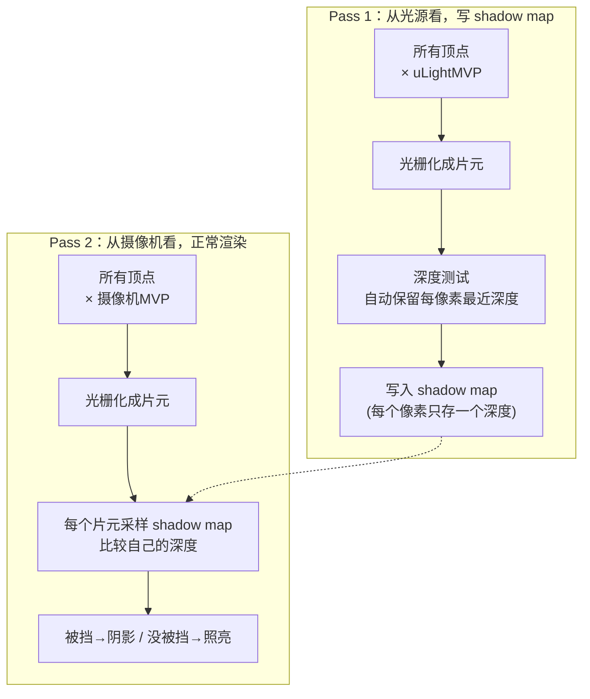

Games202 学习过程 —— 作业一 Shadow Map

---

## shadowmap script

将定向光源当作一个摄像机，那么原先摄像机 pass 经过的 MVP 变换、光栅化、深度测试，在光源通道同样可以进行。

先经历一遍筛选出离光源最近的点（NDC 空间坐标中，`shadowCoord.xy` 作为查找索引），再用摄像机视角逐个片元做深度比较。



### 复杂度为什么不高

深度测试是 GPU 光栅化时逐像素**硬件自动完成**的，不需要显式遍历排序：

- **Pass 1**：把场景用 `uLightMVP` 画到 shadow map，`gl.depthFunc(LEQUAL)` 自动只保留离光源最近的深度。
- **Pass 2**：摄像机视角每个片元变换到光空间，采样 shadow map 一个像素的深度，比较一次。

总复杂度 ≈ 画两遍场景，每个片元多一次纹理采样 + 一次比较。

### 类比

Shadow map = 从光源位置拍一张「深度照片」。Pass 2 时每个点问一句：「我在光源的照片里，是不是最靠前的那个？」是 → 亮；否 → 阴影。

---

## 复习 MVP 矩阵相关

### 光源 view 矩阵（lookAt）

直接把光源当作摄像机，`mat4.lookAt` 一行搞定，列主序、带平移都处理好了：

```js
mat4.lookAt(viewMatrix, this.lightPos, this.focalPoint, this.lightUp);
```

手动推导 lookAt 需要注意：

- 视线方向 `forward = normalize(focalPoint - lightPos)`（view 空间看向 -z）。
- 右向量 `right = normalize(forward × up)`。
- 正交化 up `u = normalize(right × forward)`。
- 视图矩阵旋转部分三行是 `right / up / forward`，还需拼平移分量。

> 一些api问题....：本项目用 gl-matrix（函数式 `vec3.cross(out, a, b)`），不是 Three.js 的实例方法 `a.crossVectors(b, c)`。混用会直接 `TypeError`。

### 正交投影 ortho 的 near / far

`mat4.ortho(left, right, bottom, top, near, far)` 里的 `near`/`far` 是**到光源的距离（正数）**，不是 view 空间的 z 坐标。

关键换算（若要从 AABB 自动算）：

```
near = -max(viewZ)   // 最近距离 = 负的最大 z（view 空间看向 -z，z 越负越远）
far  = -min(viewZ)
```

而 AABB 打印出的 `z` 是 view 空间坐标（可正可负），两者不是同一个量。

### NDC → [0,1] 纹理坐标

```glsl
vec3 shadowCoord = vPositionFromLight.xyz / vPositionFromLight.w * 0.5 + 0.5;
```

- 透视除法：`/ w`（正交投影时 w=1，无影响）。
- NDC [-1,1] → UV/深度 [0,1]：`* 0.5 + 0.5`。
- `.xy` 用于采样 shadow map，`.z` 用于深度比较。

---

## 深度比较与 bias

### 比较方向（符号是关键）

```glsl
float useShadowMap(sampler2D shadowMap, vec4 shadowCoord){
  float z = unpack(texture2D(shadowMap, shadowCoord.xy));
  return step(shadowCoord.z - uBias, z);   // 必须是「减」bias
}
```

- `z`（shadow map 存的深度）≈ 当前片元深度 `shadowCoord.z` 时，两者几乎相等。
- 被照亮：`z > shadowCoord.z - bias` → 1（亮）。
- 被遮挡：`z < shadowCoord.z - bias` → 0（阴影）。

**符号一错（用 `+bias`），所有本该亮的点全部被判为阴影 → 全黑**。这是调试中最常见的全黑原因之一。

### bias 大小与深度范围绑定

bias 是 NDC 空间的量，实际世界空间大小：

```
bias_世界 = bias_NDC × (far - near)
```

深度范围越大，同样的 bias 数值在世界空间就显得越大。改 ortho 的 near/far 后要同步重调 bias。

---

## 调试点滴（踩坑记录）

### 浏览器环境没有 require

```js
const { Vector3 } = require("three");   // ❌ 浏览器无 require
```

`require` 是 Node.js 的 CommonJS 语法，浏览器执行到会抛 `Uncaught ReferenceError: require is not defined`，整个文件中断，类无法定义，随后 `DirectionalLight is not defined`。本项目用 `<script>` 直接引用的全局脚本风格，应直接删掉 require。

### shader 编译是静默失败的

WebGL 里 shader 编译/链接失败不抛 JS 异常。`Shader.js` 里 `linkShader` 用了未定义的 `abort(...)`，一旦失败会抛 `ReferenceError` 且被 promise 吞掉，最终 `renderer.meshes` 空 → 全黑。

排查要点：

- 在 `compileShader`/`linkShader` 打印 `gl.getShaderInfoLog` / `gl.getProgramInfoLog`。
- 常见编译错误：引用未定义变量（如 `shadowCoord`）、`vec3(vec3表达式)` 非法构造、swizzle 分量数不匹配（`vec3.gba * vec4`）。

### GLSL 类型陷阱

```glsl
rgbaDepth -= rgbaDepth.gbaa * bitMask;  // ✓ gbaa 是 vec4，与 vec4 的 bitMask 匹配
// rgbaDepth.gba 是 vec3，乘 vec4 会编译失败
```

### 加载缓存导致「改了代码看不到效果」

`THREE.FileLoader` 请求 `.glsl` 会被浏览器缓存。改 shader 后看不到变化，加 cache-busting：

```js
loader.load(filename + '?t=' + Date.now(), (data) => { ... });
```

### 删方法前先搜引用

`DirectionalLight.js` 里删了 `addToLightViewAABB`，但 `loadOBJ.js` 还在调用 → `TypeError` → 异步加载中断 → 全黑只剩点光源。

固定动作：删代码前先全局搜索方法名确认无引用；删后看控制台有没有 `TypeError: xxx is not a function`。

### AABB 污染（NaN / Infinity）

自动包围盒时，若某个 mesh 的顶点数据产生 NaN，会通过 `Math.min/max` 传染整个总 AABB，最终 ortho 收到 NaN → 全黑。需要防御：

```js
if (!isFinite(mn[j]) || !isFinite(mx[j])) continue;
```

以及 `mat4.ortho` 若 `left==right`、`bottom==top`、`near==far`，会 `1/0` → Infinity/NaN。

---

## 调试工具（bias 滑杆 + 调试视图）

### 全局调试参数

```js
// engine.js
var GUIParams = {
  bias: 0.02,
  debugMode: 0, // 0=正常 1=阴影mask 2=shadowmap深度 3=片元深度 4=UV
};
```

### 材质里用 getter 实时读取

```js
// PhongMaterial.js
'uBias': { type: '1f', get value() { return GUIParams.bias; } },
'uDebugMode': { type: '1i', get value() { return GUIParams.debugMode; } },
```

这样每次渲染读 `value` 都拿到 GUI 最新值，不需要重建材质。

### GUI 面板

```js
const panel = gui.addFolder('Shadow Debug');
panel.add(GUIParams, 'bias', 0.0, 0.05, 0.0005).name('Bias').listen();
panel.add(GUIParams, 'debugMode', {
  'Normal': 0, 'ShadowMask': 1, 'ShadowMapDepth': 2, 'FragDepth': 3, 'UV': 4,
}).name('Debug View').listen();
panel.open();
```

### shader 里的调试分支

```glsl
if (uDebugMode == 1) {
  gl_FragColor = vec4(vec3(visibility), 1.0);        // 阴影 mask
} else if (uDebugMode == 2) {
  float z = unpack(texture2D(uShadowMap, shadowCoord.xy));
  gl_FragColor = vec4(vec3(z), 1.0);                 // shadow map 深度
} else if (uDebugMode == 3) {
  gl_FragColor = vec4(vec3(shadowCoord.z), 1.0);     // 当前片元光空间深度
} else if (uDebugMode == 4) {
  gl_FragColor = vec4(shadowCoord.xy, 0.0, 1.0);     // UV 分布
} else {
  gl_FragColor = vec4(phongColor * visibility, 1.0); // 正常渲染
}
```

### 各调试视图该长什么样

| 视图 | 正确时 | 异常说明 |
|---|---|---|
| ShadowMask | 物体脚下/背光处黑块 | bias 调大调小看黑边收放 |
| ShadowMapDepth | 从光源看过去，近黑远白 | 深度方向/写入有问题 |
| FragDepth | 与 ShadowMapDepth 几乎一样 | 明显不同 → MVP 或 UV 错位 |
| UV | 红绿渐变平滑 | 直接验证 UV 映射 |

---

## 关键代码改动汇总（git diff 摘要）

### DirectionalLight.js

```js
// View transform
mat4.lookAt(viewMatrix, this.lightPos, this.focalPoint, this.lightUp);

// 正交投影（固定盒子）
mat4.ortho(projectionMatrix, -111.70, 111.70, -78.98, 78.98, 0.1, 2000);

mat4.multiply(lightMVP, projectionMatrix, viewMatrix);
mat4.multiply(lightMVP, lightMVP, modelMatrix);
```

### phongVertex.glsl

```glsl
varying highp vec4 vPositionFromLight;

void main(void) {
  vFragPos = (uModelMatrix * vec4(aVertexPosition, 1.0)).xyz;
  vNormal = (uModelMatrix * vec4(aNormalPosition, 0.0)).xyz;
  gl_Position = uProjectionMatrix * uViewMatrix * uModelMatrix * vec4(aVertexPosition, 1.0);
  vTextureCoord = aTextureCoord;
  vPositionFromLight = uLightMVP * vec4(aVertexPosition, 1.0);
}
```

### phongFragment.glsl（核心）

```glsl
uniform sampler2D uShadowMap;
uniform float uBias;
uniform int uDebugMode;
varying vec4 vPositionFromLight;

float unpack(vec4 rgbaDepth) {
  const vec4 bitShift = vec4(1.0, 1.0/256.0, 1.0/(256.0*256.0), 1.0/(256.0*256.0*256.0));
  return dot(rgbaDepth, bitShift);
}

float useShadowMap(sampler2D shadowMap, vec4 shadowCoord){
  float z = unpack(texture2D(shadowMap, shadowCoord.xy));
  return step(shadowCoord.z - uBias, z);
}

void main(void) {
  float visibility;
  vec3 shadowCoord = vPositionFromLight.xyz / vPositionFromLight.w * 0.5 + 0.5;
  visibility = useShadowMap(uShadowMap, vec4(shadowCoord, 1.0));
  vec3 phongColor = blinnPhong();
  // ... debugMode 分支 ...
  gl_FragColor = vec4(phongColor * visibility, 1.0);
}
```

### loadShader.js（cache-busting）

```js
loader.load(filename + '?t=' + Date.now(), (data) => { ... });
```
